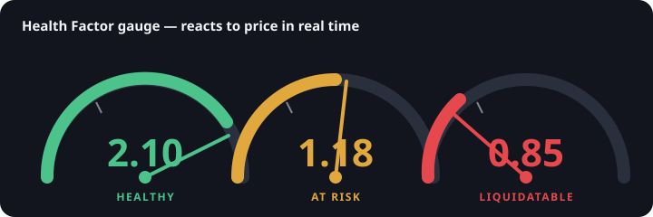

# Arc Vault — institution-grade lending on Arc

Borrow USDC against cirBTC on Arc Testnet, with the things a real credit desk
needs and the sample left out: **live risk (health factor + liquidations),
dynamic interest rates, and an on-chain credit score** — all built on Circle's
own dual-wallet, unified-write architecture.

> Arc Vault extends Circle's official [`arc-defi-lend-borrow`](https://github.com/circlefin/arc-defi-lend-borrow)
> sample (Apache-2.0). Every original pattern is preserved — wagmi/viem, the
> unified `useContractWrite` hook, MetaMask **and** Circle Passkey wallets,
> shadcn/ui, Supabase history. The five pillars below are layered on top.



## The problem

Circle's sample is deliberately minimal, and its README says so: **no
liquidation logic, no interest rate model, one loan per user, a fixed 50%
collateral factor, and cirBTC valued 1:1 with USDC** (there's no price anywhere).
That's a demo, not a credit market — it can't manage risk, can't price capital,
and can't tell a proven borrower from a new one.

## What Arc Vault adds (mapped to Circle's stated gaps)

| Circle's sample | Arc Vault |
| --- | --- |
| No liquidation logic | **Liquidation engine** — anyone can liquidate a position below health factor 1.0, repaying debt for collateral + a configurable bonus (close-factor capped). |
| cirBTC ≈ USDC, no price | **Swappable price oracle** — collateral valued at a real price; a `MockPriceOracle` on testnet, Chainlink-ready on mainnet. Health factor reacts live. |
| Interest-free | **Dynamic interest** — a kinked utilization curve accrued through a global borrow index; live borrow APR / supply APY / utilization. |
| Fixed 50% collateral factor | **On-chain credit score** (0–1000) from real repayment history that lifts a **bounded** personal collateral factor (50% → up to 65%, always below the 80% liquidation threshold). |
| One loan per user | **Multiple independent positions** per user, each with its own collateral, debt, and health factor, plus a portfolio/treasury view. |

See [ARCHITECTURE.md](ARCHITECTURE.md) for the math and design, and
[GRANT.md](GRANT.md) for how this expands USDC utility on Arc.

## 60-second reviewer quickstart

```bash
# 1. Install
npm install

# 2. Configure — copy the example and set your testnet-only PRIVATE_KEY.
#    Turn ON demo cirBTC so you can test without owning real cirBTC.
cp .env.example .env.local
#    edit .env.local: PRIVATE_KEY=<your testnet key>, NEXT_PUBLIC_USE_MOCK_CIRBTC=true

# 3. Deploy the whole stack to Arc Testnet (oracle + mock cirBTC + USDC + protocol,
#    funds the pool, writes every address back into .env.local)
NEXT_PUBLIC_USE_MOCK_CIRBTC=true npm run deploy:lending

# 4. Stage a position that's one price-tick from liquidation
npm run seed:demo

# 5. Run it
npm run dev            # http://localhost:3000
```

Then, in the app: open **Portfolio**, mint demo cirBTC and USDC, open a position
and borrow. Watch the **Health Factor gauge**. Open the **price panel**, drop
cirBTC a few percent, and watch the gauge slide from green to red. Switch to
**Liquidations**, scan the borrower, and liquidate. Full click-path in
[DEMO.md](DEMO.md).

Fund your deployer wallet (USDC is the native gas token on Arc) from
<https://faucet.circle.com/>.

## Architecture

- **Chain:** Arc Testnet — chain id `5042002`, USDC is the native gas token.
- **Contracts** (`contracts/`, Solidity 0.8.17, OpenZeppelin v4): `LendingBorrowingV2`
  (the extended protocol), `MockPriceOracle` + `IPriceOracle` (the swappable
  oracle seam), `TestnetERC20` (mock USDC and optional demo cirBTC).
- **Frontend:** Next.js App Router + TypeScript, wagmi/viem, shadcn/ui. All
  writes route through the unified `hooks/useContractWrite.ts`, so MetaMask and
  Circle Passkey wallets both work everywhere.
- **State/actions:** `hooks/lending/*` — one batched read hook, one action hook
  per operation. `lib/simulate.ts` powers the "after this…" previews;
  `lib/format.ts` centralizes number formatting (tabular figures throughout).
- **History:** Supabase `transactions` table (`supabase/migrations/`).
- **Design:** a two-metal token system (azure = dollars, gold = Bitcoin) with a
  functional risk ramp; see [DESIGN.md](DESIGN.md).

## Tokens & decimals

cirBTC (collateral) and USDC (loan) are both **8 decimals**, preserving exact
percentage math. cirBTC has no public faucet, so the **demo cirBTC** path
(`NEXT_PUBLIC_USE_MOCK_CIRBTC=true`) deploys a mintable 8-decimal mock with an
in-app mint button. The real cirBTC (`0xf0C4…432BF`) is the default/production
path.

## Scripts

| Command | What it does |
| --- | --- |
| `npm run compile` | Compile contracts (Hardhat). |
| `npm run test:contracts` | Run the Hardhat test suite (HF, liquidation, interest, credit, multi-position, access control). |
| `npm run deploy:lending` | Deploy the full stack to Arc Testnet and write addresses to `.env.local`. |
| `npm run seed:demo` | Stage a near-liquidation demo position (needs demo cirBTC). |
| `npm run dev` / `npm run build` | Run / build the frontend. |
| `npm run db:start` | Start local Supabase for transaction history. |

For server deployment steps see [SETUP.md](SETUP.md).

## License

Apache-2.0, inherited from Circle's sample. See [LICENSE](LICENSE).
